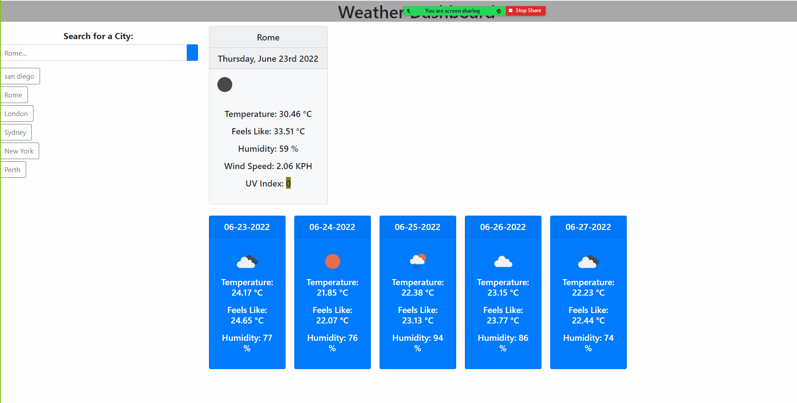

# Weather-App# Day scheduler

If you are using the Weather app you can check for weather forcasts in other places by typing in a location or destination in the search for a city  search box. 

## Features

You will see that the , search for a city search box   is were you can seach for weather information.

1. You can  also see the five day forcast for the next five days displayed

    

    also your past search city will be saved so that you can quickly research it again.

## Author

- **Vittorio Natoli**
    - Email: vittorio@emot.com.au
